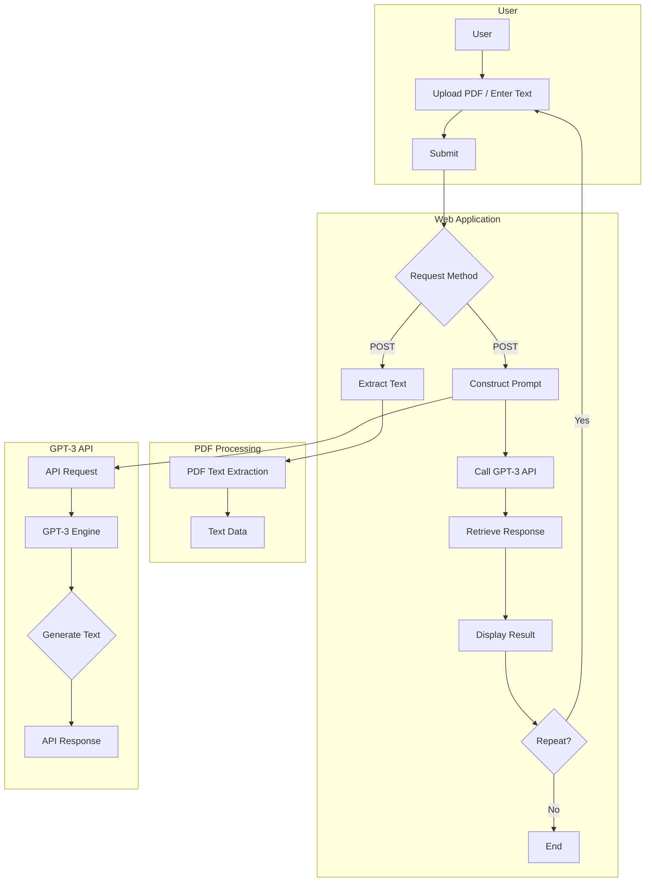

# Amex
Policy and Text input to give analysis

## Flowchart 

```mermaid
graph TD;

subgraph User
    A[User]
    A --> B[Upload PDF / Enter Text]
    B --> C[Submit]
end

subgraph Web Application
    C --> D{Request Method}
    D --> |POST| E[Extract Text]
    D --> |POST| F[Construct Prompt]
    F --> G[Call GPT-3 API]
    G --> H[Retrieve Response]
    H --> I[Display Result]
    I --> J{Repeat?}
    J --> |Yes| B
    J --> |No| End[End]
end

subgraph PDF Processing
    E --> K[PDF Text Extraction]
    K --> L[Text Data]
end

subgraph GPT-3 API
    F --> M[API Request]
    M --> N[GPT-3 Engine]
    N --> O{Generate Text}
    O --> P[API Response]
end
```
